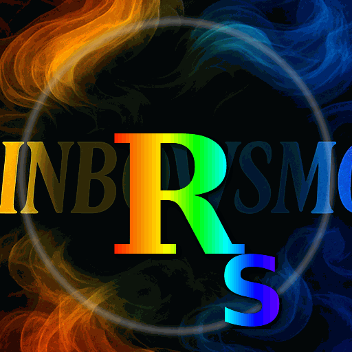

# RAINBOWSMOKE — Brand Kit

A spectrum-first identity system built around presence, contrast, and motion.

- Canonical source: `RAINBOWSMOKE.cclibs` (sha256: `9cf142065ff85c6464b98bddcb149c38fcf82a09ef9517657b8fae2b0c0bd803`)

- Asset counts: **44** images, **44** font references, **6** color themes, **1** gradient

- Machine-readable manifest: `brand.manifest.json`

## Essence
- Identity in motion
- Spectrum-forward color
- High contrast, dark-mode friendly
- Digital-native presence

## Rules
**Do:** use assets as-is, prefer SVG, keep clear space and contrast.

**Don't:** redraw, stretch/skew, recolor motion assets, invent near-match colors.

## Color themes

### pride

`#FF0000` `#FF8E00` `#FFED00` `#008026` `#004CFF` `#400098`

### pride_extended

`#FF0000` `#FF8E00` `#FFED00` `#008026` `#00C0C0` `#004CFF` `#8E008E` `#400098`

### demisexual

`#000000` `#FFFFFF` `#6E0070` `#D2D2D2`

### demiboy

`#7F7F7F` `#C4C4C4` `#9DD7EA` `#FFFFFF`

### royalty

`#0903A6` `#0F1AF2` `#1B3BF2` `#798BF2` `#F2F2F2`

### Cotton Candy

`#FCA8D8` `#A1A8E5` `#B2B3ED` `#ABCDF3` `#D2DFF2`

## Representative assets

### Social profile

- **RAINBOWSMOKE_Profile_00.10.3_decorative_clean**  
  

- **RAINBOWSMOKE_Profile_00.10.3_decorative_clean.png**  
  

- **RAINBOWSMOKE_Profile_00.10.3_rigsolid_clean**  
  

- **RAINBOWSMOKE_Profile_00.10.3_rigsolid_clean.png**  
  

- **RAINBOWSMOKE_Profile_Light_00.11.0**  
  

- **RAINBOWSMOKE_Profile_Light_00.11.0**  
  

### Glyphs / marks

- **RAINBOWSMOKE_Glyph_RS_128_00.11.0**  
  

- **RAINBOWSMOKE_Glyph_RS_128_00.11.0**  
  

- **RAINBOWSMOKE_Glyph_RS_128_00.11.0**  
  

- **RAINBOWSMOKE_Glyph_RS_256_00.11.0**  
  

- **RAINBOWSMOKE_Glyph_RS_256_00.11.0**  
  

- **RAINBOWSMOKE_Glyph_RS_256_00.11.0**  
  

### Overlays

- **RAINBOWSMOKE_Overlay_Micro_128_00.10.2**  
  

- **RAINBOWSMOKE_Overlay_Micro_128_00.10.2**  
  

- **RAINBOWSMOKE_Overlay_Micro_128_00.10.2**  
  

- **RAINBOWSMOKE_Overlay_Micro_128_00.10.2**  
  

- **RAINBOWSMOKE_Overlay_Micro_128_00.10.2.png**  
  

- **RAINBOWSMOKE_Overlay_Micro_128_00.10.2.svg**  
  

### Motion

- **RAINBOWSMOKE_Micro_Smoke_Loop_00.11.0**  
  
